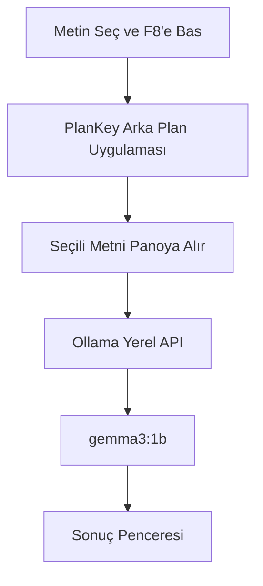

# ⚡ PlanKey

PlanKey, seçtiğin metni **F8** kısayoluyla alıp yerel Ollama modeliyle çalışma planına dönüştüren küçük bir Windows masaüstü asistanıdır. İnternet API'si kullanmaz; metinler bilgisayarındaki Ollama servisine gönderilir.


---

## Özellikler

- **Sınav Çalışma Takvimi:** Konuları günlere ve saatlere böler.
- **Günlük Pomodoro Planı:** Seçili metni 25 dakika çalışma + 5 dakika mola düzenine çevirir.
- **Konu Analizi:** Konuları öncelik ve çalışma stratejisine göre sınıflandırır.
- **Yerel çalışma:** Varsayılan model `gemma3:1b` ve Ollama'nın yerel API'sidir.

---

## Gereksinimler

- Windows 10/11
- Python 3.8 veya üzeri (`python.org` sürümü önerilir)
- Ollama
- Ollama modeli: `gemma3:1b`

Ollama kurulu değilse önce indirip kur:

```bat
https://ollama.com/download
```

Modeli indirmek için:

```bat
ollama pull gemma3:1b
```

---

## Kurulum

İlk kullanımda klasördeki dosyaları şu sırayla çalıştır:

1. `kurulum.bat`
2. `BASLAT.bat`

`kurulum.bat` şunları yapar:

- Python sürümünü kontrol eder.
- `.venv` sanal ortamını oluşturur.
- Bozuk `.venv` varsa yeniden oluşturur.
- Hem klasik Windows `Scripts` hem de MSYS/POSIX tarzı `bin` sanal ortamlarını tanır.
- Gerekli Python paketlerini kurar.
- Ollama ve `gemma3:1b` modeli için uyarı verir.

Sonraki kullanımlarda sadece `BASLAT.bat` dosyasına çift tıklaman yeterli.

---

## Kullanım

1. Ollama'nın çalıştığından emin ol.
2. `BASLAT.bat` dosyasını çalıştır.
3. PDF, Word, tarayıcı veya başka bir uygulamada metin seç.
4. **F8** tuşuna bas.
5. Açılan menüden yapmak istediğin işlemi seç.

Kapatmak için **F9** tuşuna basabilir veya F8 menüsündeki **PlanKey'i Kapat** seçeneğini kullanabilirsin.

---

## Dosyalar

- `main.pyw`: PlanKey uygulamasının ana kodu.
- `BASLAT.bat`: Uygulamayı başlatır; eksik/bozuk ortamı fark ederse kurulumu çağırır.
- `kurulum.bat`: Sanal ortamı ve paketleri kurar veya onarır.
- `requirements.txt`: Python paket listesi.
- `plankey.log`: Arka planda çalışma sırasında oluşan log dosyası. Hata ayıklamak için kullanılır.

---

## Sorun Giderme

**F8 menüsü açılmıyor**

- Önce gerçekten metin seçtiğinden emin ol.
- Bazı uygulamalar global kısayolları engelleyebilir; başka bir uygulamada dene.
- Güvenlik yazılımı klavye dinlemeyi engelliyorsa PlanKey'i yönetici olarak çalıştırmayı deneyebilirsin.

**Ollama bağlantı hatası**

- Ollama uygulamasını aç.
- Gerekirse terminalde şu komutu çalıştır:

```bat
ollama serve
```

**Model bulunamadı hatası**

Şunu çalıştır:

```bat
ollama pull gemma3:1b
```

**Program açılmıyor veya hemen kapanıyor**

- `kurulum.bat` dosyasını tekrar çalıştır.
- `.venv` bozulduysa kurulum betiği otomatik onarmaya çalışır.
- Detay için `plankey.log` dosyasına bak.

---

## Teknik Akış



---

## Lisans

Bu proje `LICENSE` dosyasındaki lisansla dağıtılır.
