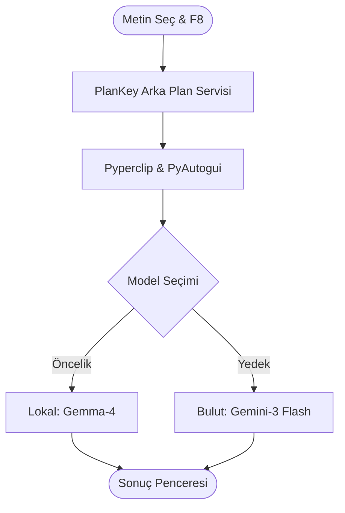

# ⚡ PlanKey: Akıllı Çalışma Asistanı

**Local AI + Akıllı Planlama = Maksimum Verim**

*PlanKey, arka planda sessizce çalışan ve ders çalışma sürecinizi yapay zeka ile optimize eden modern bir öğrenci asistanıdır.*

---

## 🚀 Hızlı Başlangıç (Tek Tıkla!)

Teknik detaylarla uğraşmak istemiyor musunuz? Sadece şu adımları izleyin:

1.  **Ollama'yı Başlatın:** Bilgisayarınızda [Ollama](https://ollama.com) uygulamasının çalıştığından emin olun.
2.  **Dosyaya Tıklayın:** Proje klasöründeki **`BASLAT.bat`** dosyasına çift tıklayın.
3.  **Hepsi Bu!** Program gerekli kurulumları otomatik yapacak ve arka planda çalışmaya başlayacaktır.

> [!TIP]
> Programın çalıştığını doğrulamak için herhangi bir metni seçip `F8` tuşuna basmanız yeterlidir.

---

## ✨ Öne Çıkan Özellikler

PlanKey, öğrenci ihtiyaçlarına yönelik üç ana mod sunar:

- **📅 Sınav Çalışma Takvimi:** Seçtiğiniz konuyu ve sınav tarihini analiz ederek, Pomodoro tekniğine uygun saatlik bir çalışma programı oluşturur.
- **⏱️ Günlük Pomodoro Planı:** Yoğun konuları 25dk odaklanma / 5dk mola döngülerine bölerek yönetilebilir görev listeleri hazırlar.
- **📊 Konu Analizi & Strateji:** İçeriği önem sırasına göre kategorize eder ve çalışma taktikleri verir.

---

## 🛠️ Teknik Mimari

PlanKey, düşük sistem kaynağı kullanarak yüksek performanslı yapay zeka yanıtları üretmek için tasarlanmıştır.

---

## 📁 Proje Yapısı

| Dosya | Görev |
| :--- | :--- |
| `main.pyw` | **Ana Motor:** Arka planda sessizce (terminalsiz) çalışır. |
| `BASLAT.bat` | **Kolay Başlatıcı:** Sanal ortamı kontrol eder ve uygulamayı çalıştırır. |
| `kurulum.bat` | **Otomatik Kurulum:** Python kütüphanelerini saniyeler içinde kurar. |
| `requirements.txt` | Gerekli bağımlılıkların listesi. |

---

## ❓ Sıkça Sorulan Sorular (FAQ)

> [!IMPORTANT]
> **Hata: "Ollama'ya bağlanılamadı"**
> Çözüm: Ollama uygulamasının açık olduğundan ve `ollama serve` komutunun çalıştığından emin olun.

> [!WARNING]
> **Hata: "Metin seçimi bulunamadı"**
> Çözüm: `F8` tuşuna basmadan önce bir metni mouse ile maviye boyadığınızdan (seçtiğinizden) emin olun.

**Soru: İnternet gerekli mi?**
Cevap: Hayır, Ollama kullandığınız sürece tamamen çevrimdışı (offline) çalışır. Sadece yedek model (Gemini) için internet gerekir.

---

## 👤 Geliştirici

**Beşşar**
*Introduction to Data Visualization Project Assignment*

---

⭐ Bu projeyi beğendiyseniz yıldız vermeyi unutmayın!

