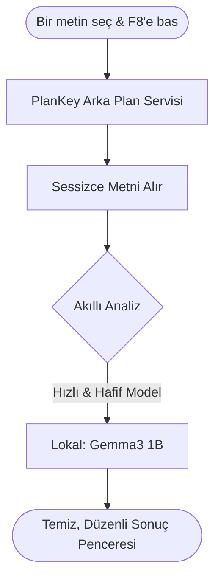

# ⚡ PlanKey: Senin Kişisel Yapay Zeka Çalışma Asistanın!

Selam! 👋 Ders çalışırken plan yapmak, konuları bölmek ve neye ne kadar süre ayıracağını düşünmek seni de yoruyor mu? İşte **PlanKey** tam da bunun için var! 

Sen ders notunu, sınav konularını veya herhangi bir metni okurken **sadece metni seçip F8 tuşuna basarsın**, PlanKey anında devreye girer ve o metni senin için analiz edip harika bir çalışma planına dönüştürür. Üstelik her şeyi arka planda, seni hiç rahatsız etmeden yapar.

 
*(Eğer elindeki o harika fotoğrafı `screenshot.png` adıyla bu klasöre kaydedersen, burası çok daha havalı görünecek!)*

---

## 🚀 Nasıl Kullanılır? (Çok Basit!)

Sadece şu adımları izle ve çalışmaya başla:

1. **Ollama'yı Başlat:** Bilgisayarındaki [Ollama](https://ollama.com) uygulamasının çalıştığından emin ol. (PlanKey tamamen senin bilgisayarındaki yapay zekayı kullanır, internete bile ihtiyaç duymaz!)
2. **Tek Tıkla Çalıştır:** Klasörün içindeki **`BASLAT.bat`** dosyasına çift tıkla. Siyah bir ekran açılıp kapanacak, korkma! PlanKey şu an arka planda sessizce nöbette. 💂‍♂️
3. **Sihri Gör:** Çalıştığın PDF'ten, Word'den veya internet sitesinden bir metin seç, klavyenden **`F8`** tuşuna bas. Karşına süper akıllı bir menü çıkacak!

---

## ✨ Neler Yapabiliyor?

F8'e bastığında karşına çıkacak olan asistanının yetenekleri:

- **📅 Sınav Çalışma Takvimi Oluştur:** "Sınava 5 gün kaldı, günde 2 saat çalışabilirim" de, o sana gün gün ne çalışman gerektiğini Pomodoro saatlerine kadar planlasın.
- **⏱️ Günlük Pomodoro Planı Yap:** O gün çalışman gereken yoğun konuları alıp, "25 dakika odaklan, 5 dakika mola ver" şeklinde senin için lokmalara bölsün.
- **📊 Konu Analizi ve Dağılımı:** Uzun bir konu listesi mi var? Hangisi daha önemli, hangisine öncelik vermelisin senin için analiz etsin ve taktik versin.

Üstelik en güzel yanı: **Sana karmaşık kodlar veya bozuk tablolar göstermez!** Tamamen senin okuyabileceğin sadelikte, çok temiz listeler sunar.

---

## 🛠️ Nasıl Çalışıyor? (Meraklısına Teknik Detay)

Sistem tamamen senin bilgisayarında, senin kaynaklarınla ve güvenle çalışır. Gelişmiş ama çok hafif olan **Gemma 3 (1B)** yapay zeka modelini kullanır. Yani bilgisayarını yormadan, şimşek hızında cevap verir!

---

## 📁 Dosyalar Ne İşe Yarıyor?

| Dosya | Görev |
| :--- | :--- |
| `main.pyw` | **Asıl Kahraman:** F8'i dinleyen ve her şeyi yöneten sessiz beyin. |
| `BASLAT.bat` | **Tembel İşi Başlatıcı:** Çift tıkla ve unut. Gereken her şeyi o ayarlar. |
| `kurulum.bat` | İlk defa kullanıyorsan gereken paketleri indirir. |

---

## 💡 Sorun Mu Yaşadın?

> [!IMPORTANT]
> **Ollama API Hatası / Bağlantı Hatası mı aldın?**
> Ollama'nın açık olduğundan emin ol. Sağ alt köşede görev çubuğunda simgesini görmelisin.

> [!WARNING]
> **Menü açılmıyor mu?**
> F8'e basmadan önce farenle bir yazıyı seçip maviye boyadığından emin ol! Seçili metin yoksa asistan neye yardım edeceğini bilemez. :)

---
*İyi çalışmalar! Verimin tavan yapsın! 🚀*
