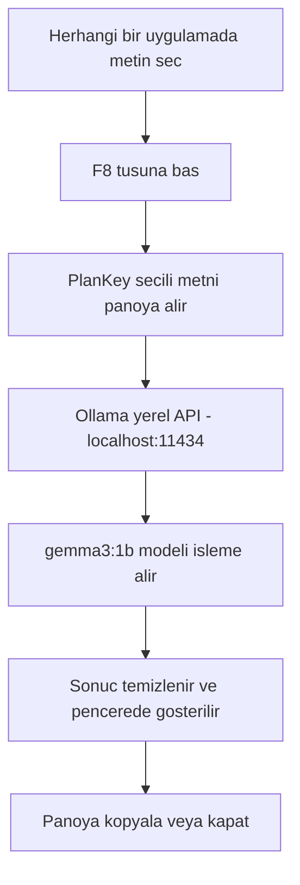

<div align="center">

# ⚡ PlanKey

**Metni seç, F8'e bas — yapay zeka çalışma planını hazırlasın.**

PlanKey; herhangi bir uygulamada seçtiğin metni anında alıp yerel Ollama modeliyle işleyen, **internet gerektirmeyen** bir Windows masaüstü asistanıdır.

---


</div>

---

## Nedir?

PlanKey, **arka planda sessizce çalışan** bir yapay zeka asistanıdır. Herhangi bir uygulama açıkken — PDF okurken, tarayıcıda gezinirken, Word belgesi düzenlerken — bir metin seçip **F8** tuşuna basman yeterli. PlanKey o metni alır, yerel Ollama modeline gönderir ve sana anında:

- Detaylı sınav çalışma takvimi
- Pomodoro tekniğine uygun günlük plan
- Konu önceliklendirmesi ve strateji

hazırlar. Tüm bunları **verilerini internete göndermeden**, tamamen bilgisayarında çalışan yerel bir AI ile yapar.

---

## Özellikler

| Özellik | Açıklama |
|---|---|
| **İnternet Gerektirmez** | Tüm AI işlemleri yerel Ollama modeli üzerinden yapılır |
| **Anlık Erişim** | Herhangi bir uygulamada F8 ile tetiklenir |
| **Metin Bazlı Giriş** | PDF, Word, tarayıcı, not defteri — herhangi bir kaynaktan metin al |
| **3 AI Modu** | Takvim, Pomodoro ve Konu Analizi işlemleri |
| **Ayrı Sonuç Penceresi** | Uzun planlar kaybolmaz, kendi penceresinde gösterilir |
| **Otomatik Log** | `plankey.log` ile her oturum kayıt altına alınır |
| **Otomatik Kurulum** | Bozuk ortamı `BASLAT.bat` kendisi tespit edip onarır |
| **Gizlilik** | Hiçbir verin dışarıya gönderilmez |

---

## Nasıl Çalışır?



1. **PlanKey arka planda çalışır** — görev çubuğunda görünmez, F8/F9 dinler
2. **F8'e basınca** seçili metni Ctrl+C ile panoya alır
3. **Prompt oluşturur** — seçilen işlem + metin birleştirilir
4. **Ollama'ya gönderir** — yerel `gemma3:1b` modeli işler
5. **Sonucu temizler** — Markdown sembolleri sade metne dönüştürülür
6. **Ayrı pencerede gösterir** — sonucu kopyalayabilir veya kapatabilirsin

---

## Gereksinimler

### Yazılım

| Gereksinim | Minimum Sürüm | İndirme |
|---|---|---|
| **İşletim Sistemi** | Windows 10 / 11 | — |
| **Python** | 3.8+ (`python.org` sürümü) | [python.org/downloads](https://www.python.org/downloads/) |
| **Ollama** | Güncel sürüm | [ollama.com/download](https://ollama.com/download) |

### Python Paketleri

`requirements.txt` içinde tanımlıdır; kurulum betiği otomatik olarak yükler:

```
requests>=2.31
pyperclip>=1.8
pynput>=1.7
```

### Ollama Modeli

```bat
ollama pull gemma3:1b
```

> **Not:** `gemma3:1b` yaklaşık **800 MB** yer kaplar ve düşük VRAM'li sistemlerde bile çalışır.

---

## Kurulum

### İlk Kurulum (Tek Seferlik)

**1.** Repoyu klonla veya ZIP olarak indir:

```bat
git clone https://github.com/bessar2004/PlanKey.git
cd PlanKey
```

**2.** Ollama'yı kur ve modeli indir:

[https://ollama.com/download](https://ollama.com/download)

```bat
ollama pull gemma3:1b
```

**3.** Kurulum betiğini çalıştır (çift tıkla):

```
kurulum.bat
```

`kurulum.bat` otomatik olarak şunları yapar:

- Python 3.8+ sürümünü kontrol eder
- `.venv` sanal ortamını oluşturur
- Bozuk `.venv` varsa siler ve yeniden oluşturur
- `pip` sürümünü günceller
- Gerekli Python paketlerini kurar ve doğrular
- Ollama ve `gemma3:1b` için uyarı verir

### Sonraki Kullanımlar

Sadece `BASLAT.bat` dosyasına **çift tıkla**. Ortam bozuksa kurulumu kendisi çağırır.

---

## Kullanım

### Adım Adım

```
1. Ollama'nın çalıştığından emin ol
      |
2. BASLAT.bat dosyasını çalıştır (PlanKey arka planda başlar)
      |
3. İstediğin uygulamada (PDF, Word, tarayıcı vb.) metin seç
      |
4. F8 tuşuna bas
      |
5. Açılan menüden işlem seç
      |
6. AI yanıtını bekle → Sonuç ayrı pencerede açılır
```

### Örnek Kullanım Senaryosu

> Sınav tarihine 10 gün kalan bir öğrenci, ders notlarından şu metni seçti:
>
> *"Türk Tarihi: Osmanlı Devleti'nin kuruluşu, Kurtuluş Savaşı, Atatürk İlkeleri. Matematik: Türev, İntegral, Limit. Günde 4 saat çalışabilirim."*

F8 → **Sınav Çalışma Takvimi Oluştur** seçildiğinde PlanKey, 10 güne yayılmış, saat saat Pomodoro planlı bir takvim hazırlar.

---

## Kısayollar

| Kısayol | İşlev |
|---|---|
| `F8` | Seçili metin için AI menüsünü aç |
| `F9` | PlanKey'i kapat (onay ister) |

---

## AI İşlemleri

### Sınav Çalışma Takvimi Oluştur

Seçili metindeki **sınav konusu**, **tarih** ve **günlük çalışma süresi** bilgilerini analiz eder. Kalan günlere Pomodoro tekniğiyle yayılmış, **saat saat** planlanmış bir takvim oluşturur.

**Örnek Girdi:** *"Coğrafya sınavım 20 Mayıs'ta, günde 3 saat çalışabilirim. Konular: iklim, nüfus, ekonomi."*

**Çıktı:** Her gün için sabah / öğleden sonra / akşam Pomodoro seansları

---

### Günlük Pomodoro Planı Yap

Seçili metindeki konuları **bugün** çalışmak üzere 25 dakika odaklanma + 5 dakika mola periyotlarına böler.

**Örnek Girdi:** *"Bugün şu konuları çalışmam lazım: Python döngüler, fonksiyonlar, OOP temelleri"*

**Çıktı:** `09:00-09:25 >> Python Döngüler` şeklinde saatlik program

---

### Konu Analizi ve Dağılımı

Seçili metindeki konuları **stratejik öneme** göre sınıflandırır; hangi konuya ne kadar zaman ayrılması gerektiğini ve hangi kaynakların kullanılacağını önerir.

**Örnek Girdi:** *"Sınavda çıkacak konular: Termodinamik, Elektrik, Optik, Dalgalar, Modern Fizik"*

**Çıktı:** Öncelikli / Orta / Tamamlayıcı kategorizasyon + strateji önerileri

---

## Proje Yapısı

```
PlanKey/
│
├── main.pyw          # Ana uygulama kodu (GUI, klavye dinleyici, Ollama API)
├── BASLAT.bat        # Başlatıcı; bozuk ortamı otomatik onarır
├── kurulum.bat       # İlk kurulum: venv, pip, paketler, Ollama kontrolü
├── requirements.txt  # Python bağımlılıkları
├── LICENSE           # Lisans dosyası
├── README.md         # Bu dosya
│
├── .venv/            # Python sanal ortamı (otomatik oluşturulur, git'e dahil değil)
└── plankey.log       # Çalışma logları (otomatik oluşturulur, git'e dahil değil)
```

---

## Sorun Giderme

### F8 menüsü açılmıyor

- Menüyü açmadan önce gerçekten metin seçtiğinden emin ol
- Bazı uygulamalar (oyunlar, tam ekran vb.) global kısayolları engelleyebilir — başka bir uygulamada dene
- Güvenlik yazılımı klavye dinlemeyi engelliyorsa PlanKey'i **yönetici olarak** çalıştır

### Ollama bağlantı hatası

Ollama servisinin çalıştığından emin ol:

```bat
ollama serve
```

Tarayıcıda şu adrese gidip yanıt geliyorsa Ollama çalışıyor demektir: `http://localhost:11434`

### "Model bulunamadı" hatası

```bat
ollama pull gemma3:1b
```

Kurulu modelleri listelemek için:

```bat
ollama list
```

### Program açılmıyor veya hemen kapanıyor

```bat
kurulum.bat
```

Kurulum betiği ortamı otomatik onarır. Sorun devam ederse `plankey.log` dosyasını incele:

```bat
type plankey.log
```

### Sonuç kalitesi düşük veya yanlış format

- Girdi metninizin yeterince açıklayıcı olduğundan emin olun
- Sınav tarihi, konu adları ve günlük süre gibi bilgileri metne ekleyin
- Daha güçlü bir model denemek için `main.pyw` içindeki `MODEL_ADI` değişkenini değiştirin

---

## Lisans

Bu proje [`LICENSE`](LICENSE) dosyasındaki lisansla dağıtılır.

---

<div align="center">

**PlanKey** — Çalışmayı planlamak artık bir F8 uzağında.

</div>
